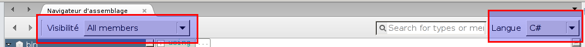

# .NET application Cheatsheet

## Recon

The `file` utility will give hint about what kind of executable you face. 

Here an example of a dotnet executable :

```
$ file bin.exe 
bin.exe: PE32 executable (GUI) Intel 80386 Mono/.Net assembly, for MS Windows
```

## Executing

To run dotnet application on linux, you need the `mono` package. Simply running `mono /path/to/bin.exe` should work. However, it does not always work. The `wine` package should be able to make it work.

## Reversing

Two tools are used. The `monodis` package will disaassemble a dotnet application into it's CIL form.

```
$ monodis bin.exe | head
.assembly extern mscorlib
{
  .ver 4:0:0:0
  .publickeytoken = (B7 7A 5C 56 19 34 E0 89 ) // .z\V.4..
}
.assembly extern System.Core
{
  .ver 4:0:0:0
  .publickeytoken = (B7 7A 5C 56 19 34 E0 89 ) // .z\V.4..
}
```

While this is neat and useful on small binaries, larger binaries will are harder to understand in CIL. The `monodevelop` package (it might be another name depending on your distro) has a nice GUI interface for disasembling dotnet both into CIL and C# form.

To do so, just install `monodevelop` and directly open the binary file. There is two option to change in the top of the monodevelop screen so we can see the C# and private properties. See screenshot below.



